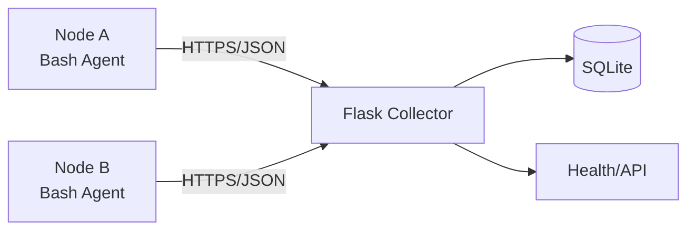

# Distributed Log Aggregator

A small distributed telemetry pipeline: lightweight Bash agents collect CPU/RAM and recent system logs, then POST JSON to a Flask collector. SQLite provides a zero-dependency development store.

## Architecture



## Quick start

```bash
cd server
python3 -m venv .venv
source .venv/bin/activate
pip install -r requirements.txt
export DLA_API_TOKEN='dev-secret'
python app.py
```

In another terminal:
```bash
export SERVER_URL='http://127.0.0.1:5000/api/v1/telemetry'
export API_TOKEN='dev-secret'
export NODE_ID='node-01'
./agent/agent.sh
```

For LAN testing, run the collector on a trusted lab network and set `SERVER_URL` to its private IP. In production, terminate TLS at a reverse proxy and use per-node credentials.

## Design decisions

JSON was chosen because telemetry is heterogeneous, easy to inspect, and supported natively by common Linux tooling. Payloads are small, so JSON's overhead is acceptable for periodic telemetry. A binary format such as MessagePack/Protobuf becomes attractive at very high event rates.

The agent is Bash-first to demonstrate Linux administration and has minimal dependencies (`curl`, `python3`). The API uses parameterized SQLite queries and constant-time token comparison.

## Production hardening

Use HTTPS, unique credentials per node, a secrets manager, rate limits, log rotation, a production WSGI server, and a durable database such as PostgreSQL. Do not expose the collector directly to the public Internet.
